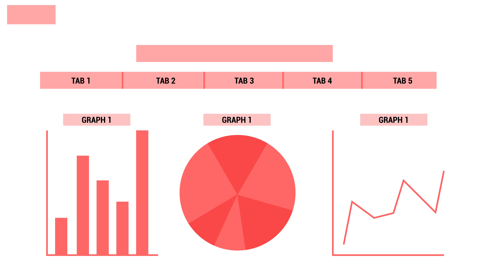

# WIREFRAME INITIAL DESGIN

## REASONING

The idea of the tab bar is mainly to enforce the navigation and filtering of the information easily instead of using a nav bar. 

Below the tab bar are various graphs and charts that the web page has to show. These get filtered when selecting the certain categories in the tab bar.

